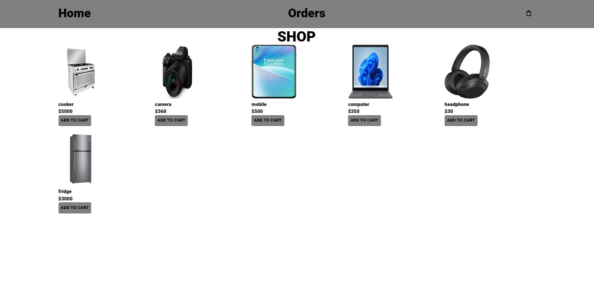
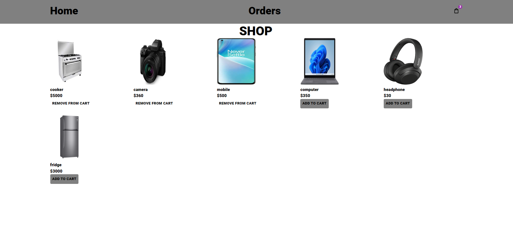
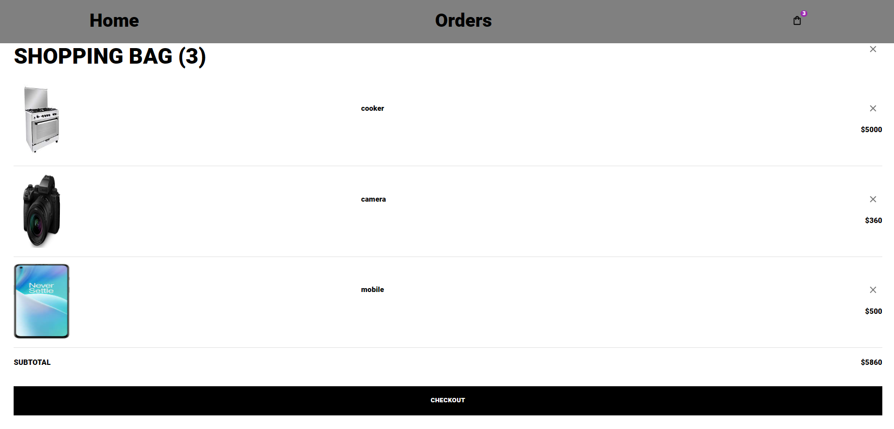
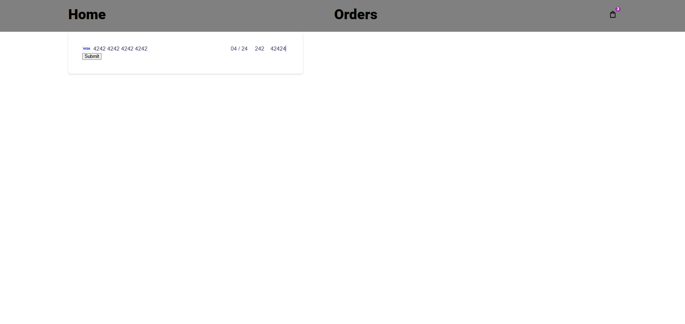
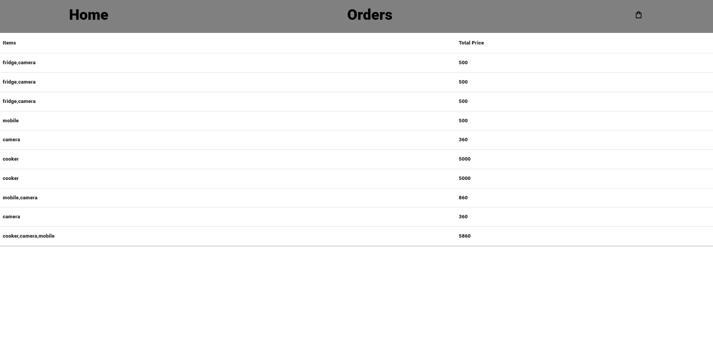

# Run
## Hosting
```
https://shop-vs6n.onrender.com
```
## Backend
```terminal
$ npm run dev
```

## Frontend
```terminal
$ npm start
```

## project structure
```terminal
LICENSE
package.json
Backend/
   package.json
   .env
   database.ts
   index.ts
   routes.ts
   controllers/
        order.controller.ts
        product.controller.ts
    models/
        order.model.ts
        product.model.ts
    ...
frontend/
   package.json
   public/
        photos/
            ...
        ...
    src/
        api/
            api.ts
            base.ts
        components/
                Chekout.tsx
                Header.tsx
                Item.tsx
                index.ts
        models/
            order.ts
            product.ts
        pages/
            CartPage.tsx
            CheckoutPage.tsx
            HomePage.tsx
            index.ts
        store/
            index.ts
        App.tsx
        index.tsx
        ...
```

# Screenshots of this project

User visit public and Home page


User selects desired products and they are added to the cart at the top rigth corner


After that the client can view the cart by clicking on it then he can drop any item or checkout


the last step is to be redirected to the payment page and after paying the client will be redirected to the Home page


the client can view the orders from the Orders tab in the Header
